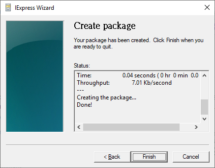

# Set a automatic ping test in Windows when startup

## Prepare a batch file for ping script


Do not use reserved / special words to name the batch files, e.g. ping.bat.




```bash
@echo off
for /f "delims=" %%a in ('wmic OS Get localdatetime  ^| find "."') do set dt=%%a
set dt=%dt:~0,8%%
ping -t 127.0.0.1|cmd /q /v /c "(pause&pause)>nul & for /l %%a in () do (set /p "data=" && echo(!date! !time! !data!)&ping -n 2 127.0.0.1>nul" >> C:\pingresult\result_%dt%.txt
```



[`@echo off`](https://docs.microsoft.com/en-us/windows-server/administration/windows-commands/echo) turns off the command echoing feature.

Save the result to `C:\pingresult\result_%dt%.txt` with date in filename.

#### Sample output



```text
28/09/2019 22:09:48.45 Pinging 127.0.0.1 with 32 bytes of data:
28/09/2019 22:09:49.46 Reply from 127.0.0.1: bytes=32 time<1ms TTL=128
28/09/2019 22:09:50.48 Reply from 127.0.0.1: bytes=32 time<1ms TTL=128
28/09/2019 22:09:51.49 Reply from 127.0.0.1: bytes=32 time<1ms TTL=128
28/09/2019 22:09:52.50 Reply from 127.0.0.1: bytes=32 time<1ms TTL=128
```



## Create a EXE to execute 


Only run batch file also work fine, but the cmd can't be hidden. If want to run it as a background job, then create a EXE and put in startup folder to run at PC startup.


Type "iexpress" and open it.


Better run as administrator



Add the batch file that prepare before.


Enter the command want to execute, e.g. `cmd /c C:\pingresult\pingtest.bat`


Maybe better to specific the path



Select "Hidden" to hidden the cmd window.


Enter the path want to save the EXE.





If below error occur, please run this wizard as administrator.



## Put the EXE in Startup folder.

1. Press **Start**, type **Run**, and press Enter.
2. In the Run window, type **shell:startup** to open the Startup folder.
3. Once the Startup folder is opened, paste the EXE file into the Startup folder.

```text
C:\Users\Username\AppData\Roaming\Microsoft\Windows\Start Menu\Programs\Startup
```


## Reference












