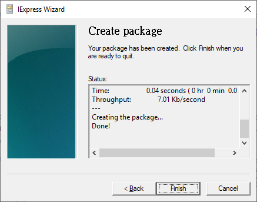

# File explorer slow responding

1. 開啟檔案總管，點選【檢視】--&gt;【選項】

2. 按下【**清除**】按鈕，就可以解決此問題！

原來 Windows 10 的「**快速存取**」\(Quick Access\) 就是拖慢我檔案總管執行速度的主因！

只要用一段時間，只要你頻繁的開啟任何檔案，電腦速度就會自然變慢

這裡的快速存取，就是保存所有你曾經開過的檔案歷史紀錄，預設實體路徑放在 _**%APPDATA%\Microsoft\Windows\Recent**_，你只要在你的電腦開啟過任何檔案或資料夾，就會在這個資料夾建立相對應的捷徑，當捷徑過多時，很可怕，而且系統似乎不會自動清除這些捷徑檔案。

Reference: [https://blog.miniasp.com/post/2016/12/29/Windows-10-Explorer-Slow-problem-and-solution.aspx](https://blog.miniasp.com/post/2016/12/29/Windows-10-Explorer-Slow-problem-and-solution.aspx)

